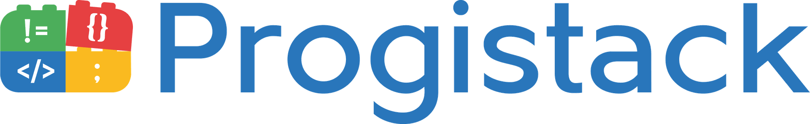

---

<h1 align="center">Salut </a>, Bienvenue sur le repository de Progistack</h1>
<h3 align="center">
  Modernisez vos processus métier avec notre expertise digitale, grâce à des
  solutions adaptées à vos défis d'aujourd'hui et de demain
</h3>

  

<h3 align="left">Rétrouvez nous sur:</h3>

  
  

 

## ⚡ Outils

---

---

---

---

---

---

---

---

---

---

---
